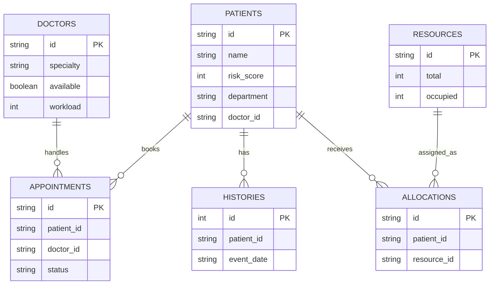

# Database Schema

```mermaid
erDiagram
    PATIENTS ||--o{ APPOINTMENTS : books
    DOCTORS ||--o{ APPOINTMENTS : handles
    PATIENTS ||--o{ HISTORIES : has
    PATIENTS ||--o{ ALLOCATIONS : receives
    RESOURCES ||--o{ ALLOCATIONS : assigned_as

    PATIENTS {
        string id PK
        string name
        int risk_score
        string department
        string doctor_id
    }
    DOCTORS {
        string id PK
        string specialty
        boolean available
        int workload
    }
    APPOINTMENTS {
        string id PK
        string patient_id
        string doctor_id
        string status
    }
    RESOURCES {
        string id PK
        int total
        int occupied
    }
    ALLOCATIONS {
        string id PK
        string patient_id
        string resource_id
    }
    HISTORIES {
        int id PK
        string patient_id
        string event_date
    }
```
