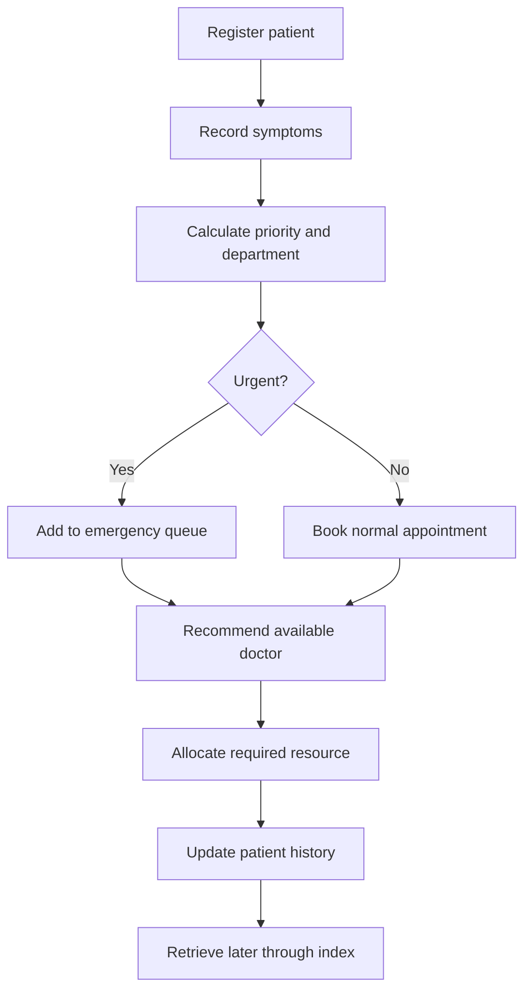

# Main Project Workflow

```mermaid
flowchart TD
    A[Register patient] --> B[Record symptoms]
    B --> C[Calculate priority and department]
    C --> D{Urgent?}
    D -- Yes --> E[Add to emergency queue]
    D -- No --> F[Book normal appointment]
    E --> G[Recommend available doctor]
    F --> G
    G --> H[Allocate required resource]
    H --> I[Update patient history]
    I --> J[Retrieve later through index]
```
